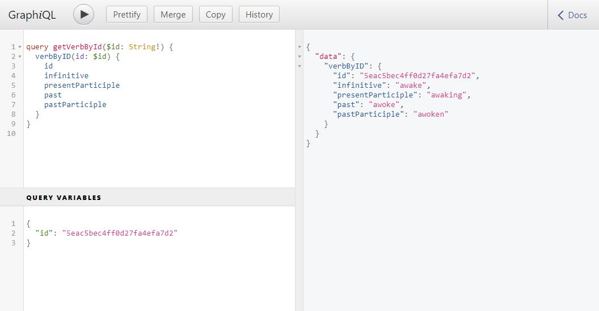

# iVerb graphQL API

## Run the server

```bash
npm run start
```

## Query the API

Once the server is up and running open GraphiQL at [http://localhost:4000/graphql](http://localhost:4000/graphql)

### Get all the verbs

```graphql
{
  verbs {
    id
    infinitive
    presentParticiple
    past
    pastParticiple
  }
}
```

### Get verb by id



Use the following query

```graphql
query getVerbById($id: String!) {
  verbByID(id: $id) {
    id
    infinitive
    presentParticiple
    past
    pastParticiple
  }
}
```

And for example the following for the Query variables

```graphql
{
  "id": "5eac5bec4ff0d27fa4efa7d2"
}
```
